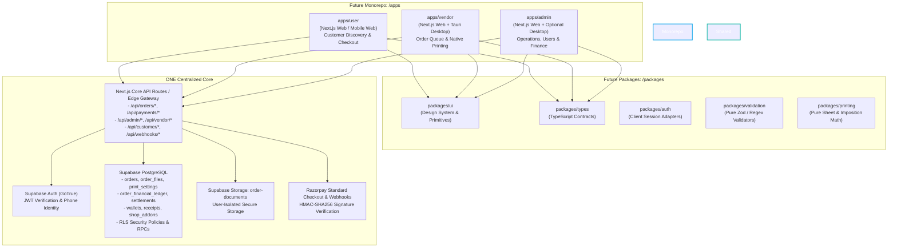
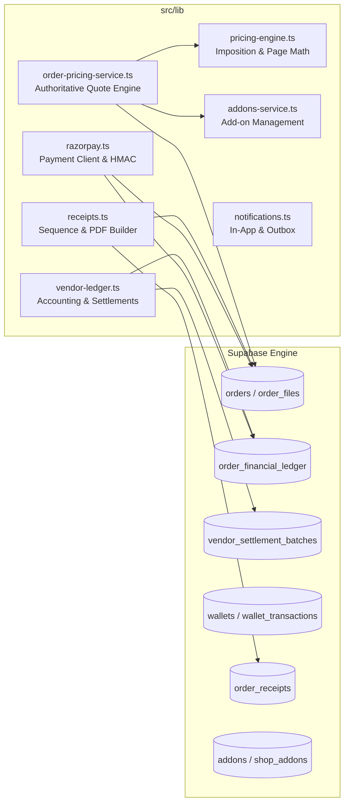

> Historical migration plan. Superseded by the one-website plus native-desktop setup in [README](../README.md). Separate user/admin/vendor frontend projects have been retired.

# XerService — Architecture Boundaries & Monorepo Migration Blueprint

> **Status**: FROZEN (Architecture & Boundary Specification Only)
> **Target Monorepo Layout**: `apps/{user, vendor, admin}` backed by ONE shared backend and ONE Supabase database
> **Security Policy**: Strict Server-Side Financial Authority — Client Calculations for Display Only

---

## Executive Overview

This document freezes and formalizes the architectural boundaries for the **XerService** platform. It provides the definitive technical specification for decoupling the current monolithic Next.js repository into a production-grade monorepo containing three specialized frontend applications (`apps/user`, `apps/vendor`, and `apps/admin`) while retaining **ONE shared, authoritative backend** and **ONE Supabase project**.

### Core Invariants

1. **Zero Database Duplication**: A single PostgreSQL database on Supabase remains the single source of truth for all schemas, row-level security (RLS) policies, storage buckets, and database triggers/functions.
2. **Zero Financial Ledger Relocation**: All pricing calculations, quotes, payment preparations, signature validations, wallet transactions, commission deductions, receipts, and settlements are strictly server-side authoritative and must NEVER be moved to client-side code or shared UI libraries.
3. **No File Moves in Step 1**: This step is strictly an architectural freeze and documentation milestone. No files, folders, database schemas, or runtime behaviors are altered during this phase.



---

## 1. Current Architecture (Monolith Inspection)

### 1.1 Current Next.js Structure

The repository (`XerService - Codex`) is currently structured as a monolithic **Next.js 15.5.24** App Router application using React 18, TypeScript 5, and Supabase client libraries (`@supabase/supabase-js 2.116.0`). All routes, client interfaces, server actions, API handlers, and backend business logic live inside the `src/` directory.

```
XerService - Codex/
├── docs/                        # Architecture boundaries & documentation
├── public/                      # Static assets, logos, PDF.js worker files
├── scripts/                     # Automated testing & verification suites
├── src/
│   ├── app/                     # Next.js App Router (Pages, Layouts, API Route Handlers)
│   │   ├── admin/               # Admin presentation routes
│   │   ├── api/                 # 47 Server-side API route handlers
│   │   ├── auth/                # Auth callbacks
│   │   ├── cart/                # Customer cart interface
│   │   ├── dashboard/           # Customer account, wallet, order history
│   │   ├── order/               # Customer ordering pipeline (upload, pricing, payment)
│   │   ├── shops/               # Shop directory & details
│   │   ├── vendor/              # Vendor presentation routes
│   │   ├── xad/                 # Legacy admin entry points
│   │   ├── layout.tsx           # Global app layout & AppProvider wrapper
│   │   └── page.tsx             # Landing / shop discovery homepage
│   ├── components/              # React UI components
│   │   ├── admin/               # Admin tables, KPIs, user/vendor modals
│   │   ├── layout/              # Header, footer, navigation bars
│   │   ├── notifications/       # Bell popover, notification lists
│   │   ├── order/               # Live preview, print settings modal, status chat
│   │   ├── pdf/                 # Canvas-based PDF viewer (LivePrintPreview)
│   │   ├── profile/             # Profile drawer, settings
│   │   └── ui/                  # Buttons, cards, modals, tabs, switches
│   ├── context/                 # Client React Contexts (AppContext.tsx)
│   ├── lib/                     # Server services, helpers, math engines, DB clients
│   │   ├── auth/                # OTP authentication provider abstractions
│   │   ├── supabase/            # Browser and Service-Role Supabase client instances
│   │   ├── addons-service.ts    # Print add-on management & snapshot calculations
│   │   ├── admin-auth.ts        # Admin route JWT & role verification guard
│   │   ├── notification-outbox.ts# Async SMS/WhatsApp notification outbox
│   │   ├── notifications.ts     # In-app notification creation & metadata sanitizer
│   │   ├── order-pricing-service.ts # Authoritative server order quote engine
│   │   ├── pricing-engine.ts    # Pure page imposition, sheet, and selection math
│   │   ├── print-settings.ts    # Print specifications mapping & canvas calculators
│   │   ├── razorpay.ts          # Server-only Razorpay order creation & HMAC verification
│   │   ├── receipts.ts          # Server receipt generation & PDF binary builder
│   │   └── vendor-ledger.ts     # Financial accounting ledger & settlements engine
│   └── styles/                  # Global CSS variables, animations, resets
└── supabase/
    └── migrations/              # 20 PostgreSQL schema migrations & RPCs
```

---

### 1.2 Current Customer Routes

All customer-facing routes run under `src/app/` and serve general website visitors and registered students/customers:

| Route Path | File Location | Purpose & Functionality |
|---|---|---|
| `/` | `src/app/page.tsx` | Homepage, campus hero, print shop finder, campus directory |
| `/shops` | `src/app/shops/page.tsx` | Print partner directory, campus map, operating status |
| `/shops/[id]` | `src/app/shops/[id]/page.tsx` | Individual shop profile, pricing table, supported add-ons |
| `/order/upload` | `src/app/order/upload/page.tsx` | Multi-file document upload, client-side PDF page counting, validation |
| `/order/pricing` | `src/app/order/pricing/page.tsx` | **Unified "Review & Pay"**: Live preview, settings pills, add-ons, Razorpay & wallet checkout |
| `/order/payment` | `src/app/order/payment/page.tsx` | Backward-compatible redirect forwarding directly to `/order/pricing` |
| `/order/settings` | `src/app/order/settings/page.tsx` | Standalone print settings editor route |
| `/order/method` | `src/app/order/method/page.tsx` | Legacy pickup method selection redirecting to `/order/pricing` |
| `/cart` | `src/app/cart/page.tsx` | Shopping cart for saved draft orders and bundled checkouts |
| `/dashboard` | `src/app/dashboard/page.tsx` | Customer dashboard overview and active orders summary |
| `/dashboard/orders` | `src/app/dashboard/orders/page.tsx` | Order history list, status badges, tracking chat, receipt downloads |
| `/dashboard/profile` | `src/app/dashboard/profile/page.tsx` | User profile, phone verification, campus preferences |
| `/dashboard/wallet` | `src/app/dashboard/wallet/page.tsx` | XerCoins balance, transaction ledger history, top-up modal |
| `/login` | `src/app/login/page.tsx` | Customer authentication (Email OTP, Magic Link, Google OAuth) |
| `/signup` | `src/app/signup/page.tsx` | Account registration portal |
| `/forgot-password`| `src/app/forgot-password/page.tsx` | Password reset request portal |
| `/auth/callback` | `src/app/auth/callback/page.tsx` | Supabase OAuth and magic link token exchange handler |
| `/how-it-works` | `src/app/how-it-works/page.tsx` | Informational walkthrough for new students |
| `/contact` | `src/app/contact/page.tsx` | Support contact form and campus reprography helpdesk info |
| `/enterprise` | `src/app/enterprise/page.tsx` | Institutional & departmental bulk printing inquiry form |
| `/colors` | `src/app/colors/page.tsx` | Palette reference and UI token test bench |
| `/palette` | `src/app/palette/page.tsx` | Design system visual token preview |

---

### 1.3 Current Vendor Routes

Vendor routes serve print shop owners and kiosk operators managing production:

| Route Path | File Location | Purpose & Functionality |
|---|---|---|
| `/vendor` | `src/app/vendor/page.tsx` | Vendor landing / redirect to dashboard |
| `/vendor/login` | `src/app/vendor/login/page.tsx` | Dedicated vendor login portal |
| `/vendor/join` | `src/app/vendor/join/page.tsx` | Vendor onboarding & print shop registration portal |
| `/vendor/dashboard` | `src/app/vendor/dashboard/page.tsx` | Vendor operations hub: Live order queue, status transitions (`QUEUED` $\to$ `PRINTING` $\to$ `READY` $\to$ `COMPLETED`), secure file download trigger, store open/closed toggle, earnings summary |

---

### 1.4 Current Admin Routes

Admin routes serve platform operators managing finances, users, shops, and system controls:

| Route Path | File Location | Purpose & Functionality |
|---|---|---|
| `/admin` | `src/app/admin/page.tsx` | Admin overview, platform health, rapid navigation |
| `/admin/login` | `src/app/admin/login/page.tsx` | Admin security login with strict role gate |
| `/admin/users` | `src/app/admin/users/page.tsx` | User and vendor account manager: list, create customer/vendor, disable, password reset, audit-protected deletion |
| `/admin/vendors` | `src/app/admin/vendors/page.tsx` | Print shop operator and physical kiosk registry |
| `/admin/finance` | `src/app/admin/finance/page.tsx` | Financial console: Commission rules (basis points), financial ledger audit, settlement batch generation and payment confirmation |
| `/admin/addons` | `src/app/admin/addons/page.tsx` | Add-on catalog manager: create finishing add-ons, price assignment, page limits, global toggle |
| `/xad/login` | `src/app/xad/login/page.tsx` | Legacy admin route alias |
| `/xad/dashboard` | `src/app/xad/dashboard/page.tsx` | Legacy admin overview alias |

---

### 1.5 Current API Routes (47 Route Handlers)

The API layer is organized into domain categories under `src/app/api`:

#### Customer API Endpoints
- `POST /api/orders/[orderId]/quote`: Calculates and atomically persists authoritative order quotes.
- `POST /api/orders/[orderId]/payment/prepare`: Prepares Razorpay payment attempt and locks authoritative amount.
- `POST /api/orders/[orderId]/payment/wallet`: Processes instant student wallet (XerCoins) payment via atomic database deduction.
- `POST /api/orders/[orderId]/cancel`: Evaluates order cancellation, authorizes customer refund, and creates ledger reversals.
- `GET /api/customer/orders`: Returns customer order history with live status.
- `GET /api/customer/orders/[orderId]/files/[fileId]/download`: Generates secure signed URL / stream for authorized customer document retrieval.
- `GET /api/customer/orders/[orderId]/receipt`: Generates structured receipt JSON or pure binary PDF receipt (`format=pdf`).
- `GET /api/customer/wallet`: Retrieves real-time student XerCoins balance and transaction history.
- `POST /api/customer/phone/sync`: Normalizes and synchronizes verified phone identity.
- `DELETE /api/customer/account/delete`: Initiates audit-protected customer account deletion.

#### Vendor API Endpoints
- `GET /api/vendor/orders`: Fetches live print order queue filtered by assigned shop.
- `POST /api/vendor/orders/[orderId]/status`: Advances order status (`QUEUED` $\to$ `PRINTING` $\to$ `READY` $\to$ `COMPLETED`) via database RPC.
- `POST /api/vendor/orders/[orderId]/cancel`: Cancels unfulfilled order with vendor reason code and triggers refund.
- `GET /api/vendor/orders/[orderId]/files/[fileId]/download`: Authorizes print operator to stream customer PDF for physical printing.
- `GET /api/vendor/overview`: Returns shop KPIs (today's orders, revenue, pending sheets).
- `GET /api/vendor/finance/orders`: Returns detailed order financial ledger rows for the vendor's shop.
- `GET /api/vendor/finance/summary`: Computes vendor gross, commission deducted, payable earnings, and settled amounts.
- `GET /api/vendor/settlements`: Lists historical settlement batches and payment references.
- `GET /api/vendor/addons`: Lists shop add-ons and assigned pricing.
- `PATCH /api/vendor/addons/[id]/availability`: Rejects vendor price modifications (403); permits shop availability toggling.

#### Admin API Endpoints
- `GET /api/admin/users`: Lists accounts with search, role filters (`customer`, `vendor`), status metrics, omitting plaintext credentials.
- `POST /api/admin/users`: Creates customer or vendor (with shop registration) account with phone canonicalization.
- `GET /api/admin/users/[userId]`: Returns user detail, linked print shops, and transaction audit records.
- `PATCH /api/admin/users/[userId]`: Updates account details, phone, or active/disabled status (with self-disable protection).
- `DELETE /api/admin/users/[userId]`: Performs audit-protected deletion (rejects 409 Conflict if historical orders/ledger exist).
- `POST /api/admin/users/[userId]/reset-password`: Generates secure password recovery link via Supabase Auth Admin.
- `GET /api/admin/vendors`: Lists vendor profiles and operational kiosks.
- `GET /api/admin/vendors/[userId]`: Returns detailed vendor metrics and assigned shops.
- `PATCH /api/admin/vendors/[userId]`: Updates vendor settings.
- `POST /api/admin/vendors/[userId]/reset-password`: Generates vendor password reset link.
- `GET /api/admin/finance/summary`: Computes platform-wide financial summary (GMV, platform fees, vendor payables, settled totals).
- `GET /api/admin/finance/shops`: Returns per-shop financial metrics and active commission rates.
- `GET /api/admin/finance/shops/[shopId]`: Detailed financial profile for a specific shop.
- `GET /api/admin/finance/commission-rules`: Lists basis-point commission rules across shops.
- `POST /api/admin/finance/commission-rules`: Creates or updates shop commission rule.
- `POST /api/admin/finance/commission-rules/[ruleId]/apply`: Retroactively audits and applies commission rule to eligible orders.
- `GET /api/admin/finance/settlements`: Lists platform settlement batches.
- `POST /api/admin/finance/settlements`: Generates a new settlement batch for payable vendor earnings.
- `GET /api/admin/finance/settlements/[id]`: Returns settlement batch detail and itemized orders.
- `POST /api/admin/finance/settlements/[id]/confirm`: Locks settlement batch from `DRAFT` to `CONFIRMED`.
- `POST /api/admin/finance/settlements/[id]/mark-paid`: Marks settlement `PAID` with external bank/UTR reference and settles ledger rows.
- `POST /api/admin/finance/settlements/[id]/cancel`: Reverts settlement batch and releases order ledger items back to `PAYABLE`.
- `GET /api/admin/addons`: Returns all finishing add-ons in the global catalog.
- `POST /api/admin/addons`: Creates a new finishing add-on with page limit rules.
- `GET /api/admin/addons/[id]`: Returns add-on specifications and per-shop pricing assignments.
- `PUT /api/admin/addons/[id]`: Updates add-on specifications, default price, or active status.
- `DELETE /api/admin/addons/[id]`: Deletes or deactivates add-on.
- `POST /api/admin/addons/upload-image`: Uploads add-on visual asset to storage.

#### Core Platform, Payments & Utility Endpoints
- `POST /api/payments/razorpay/verify`: Validates Razorpay signature, marks order paid, records ledger row, queues notification.
- `POST /api/webhooks/razorpay`: Authoritative asynchronous Razorpay webhook processor (HMAC verified).
- `GET /api/shops/[shopId]/addons`: Public catalog of available add-ons and pricing for a specific shop.
- `POST /api/pdf/analyze`: Server-side PDF validation, page extraction, and integrity check.
- `GET /api/notifications`: Customer/vendor notification stream.
- `POST /api/notifications/[id]/read`: Marks notification read.
- `POST /api/notifications/read-all`: Marks all user notifications read.
- `GET /api/health`: Platform health, database connectivity, and environment check.

---

### 1.6 Current Subsystems & Core Services



* **Authentication & Identity**: Handled via `@/lib/supabase/client` on the browser and `@/lib/supabase/server` on the server. Identity tokens are verified using `supabase.auth.getUser()`. The user's role (`customer`, `vendor`, `admin`) is authoritatively retrieved from the `profiles` table. Admin routes are guarded by `@/lib/admin-auth.ts` (`requireAdminAuth`), which rejects non-admin users with HTTP 403.
* **Storage**: Private Supabase Storage bucket `order-documents`. Files are named with UUIDs and organized in paths formatted as `users/{user_id}/orders/{order_id}/{file_id}/{original_filename}`. Downloads require bearer authorization via API routes.
* **Razorpay Payment Flow**:
  1. Client calls `POST /api/orders/[orderId]/payment/prepare`. Server checks that the order is `DRAFT` or `AWAITING_PAYMENT`, creates an authoritative Razorpay order via Razorpay API, and creates a `payment_attempts` record with status `INITIATED`.
  2. Browser opens Razorpay Standard Checkout modal.
  3. On success callback, browser submits `razorpay_payment_id`, `razorpay_order_id`, and `razorpay_signature` to `POST /api/payments/razorpay/verify`.
  4. Server recomputes `HMAC-SHA256(order_id + "|" + payment_id, secret)` using crypto. If valid, it marks the payment attempt `PAID`, transitions order status to `PAID`, records a vendor financial ledger row, and triggers in-app and outbox notifications.
  5. Webhook `POST /api/webhooks/razorpay` verifies webhook signatures and handles asynchronous capture as a fail-safe.
* **Order Lifecycle**: States transition sequentially:
  $$\text{DRAFT} \longrightarrow \text{AWAITING\_PAYMENT} \longrightarrow \text{PAID} \longrightarrow \text{QUEUED} \longrightarrow \text{PRINTING} \longrightarrow \text{READY} \longrightarrow \text{COMPLETED}$$
  or $\text{CANCELLED}$ at eligible points. Transitions are governed by database RPC `vendor_advance_order_status` and server endpoints.
* **Wallet / XerCoins**: Pre-paid student credits managed via `wallets` and `wallet_transactions` tables. Atomic deductions occur via database functions with row-level locks, preventing negative balances or double-spend race conditions.
* **Receipts**: Managed in `src/lib/receipts.ts`. Enforces sequential numbering (`XSR-YYYY-NNNNNN`), immutable database persistence in `order_receipts`, and server-side PDF generation using `pdf-lib`.
* **Vendor Financial Ledger & Settlements**: Managed in `src/lib/vendor-ledger.ts`. Implements strict accounting:
  $$\text{gross\_amount} = \text{platform\_commission\_amount} + \text{vendor\_net\_amount}$$
  Platform commission rates are configured in basis points (`100 bps = 1%`). Settlements bundle completed order items into batches (`DRAFT` $\to$ `CONFIRMED` $\to$ `PAID`), tracking bank/UTR transfer references.
* **Add-ons Subsystem**: Managed in `src/lib/addons-service.ts`. Stores add-ons in `addons`, assigns per-shop pricing in `shop_addons`, and freezes immutable prices into `order_file_addons` upon order placement.

---

## 2. Future Application Ownership

In the target monorepo architecture, user interface and client workflow responsibilities will be separated into three distinct Next.js applications under `apps/`:

```
apps/
├── user/               # Customer-Facing Web Application
├── vendor/             # Vendor Operations Web & Desktop App
└── admin/              # Platform Operations & Finance Console
```

### 2.1 User App (`apps/user`)
**Target Audience**: Students, faculty, campus visitors.
**Platform**: Responsive Web, Mobile Web (PWA ready).

**Owns Exclusively**:
* Public marketing website and campus landing page (`/`, `/how-it-works`, `/enterprise`, `/contact`).
* Print shop discovery, campus map, operating hours, and shop service catalog (`/shops`, `/shops/[id]`).
* Customer authentication, sign up, password recovery, session handling (`/login`, `/signup`, `/forgot-password`, `/auth/callback`).
* File upload pipeline, browser-side drag-and-drop, client-side PDF page calculation (`/order/upload`).
* Print settings configuration interface (`Paper`, `Color`, `Sides`, `Copies`, `Pages per Sheet`, `Page Range`).
* Unified **"Review & Pay"** checkout interface (`/order/pricing`), canvas-based live print preview (`LivePrintPreview`), add-ons selection, and Razorpay modal integration.
* Customer cart management for bundling print jobs (`/cart`).
* Customer self-service dashboard: order history list, live order status tracker, tracking chat, PDF receipt download (`/dashboard`, `/dashboard/orders`).
* Student profile management, campus dorm/department selection, verified phone linking (`/dashboard/profile`).
* XerCoins wallet management, balance top-up UI, transaction history (`/dashboard/wallet`).

### 2.2 Vendor App (`apps/vendor`)
**Target Audience**: Print shop owners, kiosk operators, student reprography staff.
**Platform**: Next.js Web UI, wrapped in a **Tauri Desktop Application** for native hardware control.

**Owns Exclusively**:
* Vendor authentication and store operator login (`/vendor/login`, `/vendor/join`).
* Real-time print queue interface (`/vendor/dashboard`), sound/visual alerts for incoming jobs.
* Order fulfillment state machine triggers (`QUEUED` $\to$ `PRINTING` $\to$ `READY` $\to$ `COMPLETED`).
* Cancellation workflows with vendor operational reason codes (`out of paper`, `hardware jam`).
* Secure one-click document download and physical print triggering.
* Store availability control (Open, Busy, Paused, Closed toggle).
* Shop add-on availability toggle (enabling or temporarily disabling specific finishing services based on physical supply levels).
* Vendor performance overview: today's completed sheets, order throughput, customer ratings.
* Vendor financial view: itemized order earnings, platform commission deductions, payable balance, settlement history, and payout advice downloads.

### 2.3 Admin App (`apps/admin`)
**Target Audience**: Platform administrators, finance officers, campus operations team.
**Platform**: Next.js Web Application (desktop-optimized).

**Owns Exclusively**:
* Admin authentication with strict multi-factor authentication and role gates (`/admin/login`).
* User and identity management console: list, search, inspect customer/vendor profiles, manual password reset link generation, account disable/enablement, audit-protected deletion (`/admin/users`).
* Print partner kiosk and vendor store directory management (`/admin/vendors`).
* Platform-wide finance console (`/admin/finance`):
  * Gross Merchandise Value (GMV), net platform fee revenue, vendor liability metrics.
  * Shop commission rule manager (configuring basis-point commission rules and effective date windows).
  * Automated settlement batch generation, invoice confirmation, payout marking with bank UTR tracking, and cancellation/reversal controls.
* Finishing add-on catalog management (`/admin/addons`): global add-on creation, icon/asset upload, page constraint definitions (minimum/maximum pages), and per-shop price assignments.
* System configuration, error telemetry, audit log inspection, and notification dispatch health.

---

## 3. Shared Backend — Must NOT Be Duplicated

To prevent split-brain states, race conditions, financial drift, or security vulnerabilities, the following components **MUST REMAIN AUTHORITATIVE IN ONE CENTRALIZED BACKEND AND ONE SUPABASE INSTANCE**:

```
Centralized Backend Authority (DO NOT DUPLICATE)
├── Database & Auth
│   ├── Supabase PostgreSQL Database (Single production instance)
│   ├── Supabase Auth (GoTrue identity, user IDs, OAuth providers)
│   ├── Database Profiles (`profiles` table as single source of user roles)
│   └── Row-Level Security (RLS) policies and security definer functions
├── Storage
│   └── Private storage bucket `order-documents` & access permissions
├── Order Lifecycle & Pricing
│   ├── Orders & files schema (`orders`, `order_files`, `print_settings`)
│   ├── Authoritative pricing engine (`order-pricing-service.ts`, `pricing-engine.ts`)
│   └── Server-side quote calculation (`POST /api/orders/[orderId]/quote`)
├── Payment & Financial Engine
│   ├── Razorpay order preparation (`POST /api/orders/[orderId]/payment/prepare`)
│   ├── Razorpay HMAC-SHA256 signature verification (`POST /api/payments/razorpay/verify`)
│   ├── Razorpay Webhook processor (`POST /api/webhooks/razorpay`)
│   ├── Payment attempts ledger (`payment_attempts` table)
│   ├── Student XerCoins double-entry ledger & atomic deduction RPC
│   ├── Cancellation and customer refund execution (`cancel_order_with_refund` RPC)
│   ├── Official order receipt numbering & PDF generator (`receipts.ts`)
│   ├── Vendor financial ledger (`order_financial_ledger` table)
│   └── Vendor settlement batching engine (`vendor-ledger.ts`)
└── Communication & Security
    ├── In-app notification engine & sanitize metadata guard
    ├── Notification outbox queue (`notification_outbox` table)
    └── Document validation, sanitization & download permission gates
```

> [!CAUTION]
> **Strict Prohibition**: None of the three frontend applications (`apps/user`, `apps/vendor`, `apps/admin`) may ever implement their own payment capture, quote calculation, commission math, or direct status override. All actions must pass through authoritative server API routes or database RPCs.

---

## 4. Printing Architecture

### 4.1 What Exists Today (Web Tier)

The current printing implementation operates entirely within the browser and Node.js server environment:

```
Current Printing Capabilities
├── Browser-Side (Customer Tier)
│   ├── PDF analysis via `pdfjs-dist` (extracts page counts, dimensions)
│   ├── Image-to-PDF conversion via `pdf-lib` (converts PNG/JPEG uploads to valid PDF)
│   ├── Canvas-based print preview (`LivePrintPreview.tsx`)
│   │   ├── Sheet rendering with zoom, pan, and page flip
│   │   ├── Imposition preview (1, 2, 4, 6 pages per sheet)
│   │   ├── Duplex simulation (long-edge and short-edge flip)
│   │   └── Color mode simulation (monochrome grayscale vs full color)
│   └── Print settings mapping (`print-settings.ts`)
└── Server-Side (API Tier)
    ├── PDF byte inspection and page count validation (`/api/pdf/analyze`, `pdf-lib`)
    ├── Authoritative pricing math (`pricing-engine.ts`)
    └── Physical sheet calculation based on sides and imposition rules
```

### 4.2 What DOES NOT Exist Yet (Hardware & Desktop Tier)

The current codebase **lacks all physical and operating system printer hardware integrations**:

1. **OS Printer Discovery**: No detection of locally attached USB, network, or wireless printers.
2. **Printer Capability Detection**: No query of supported hardware paper trays (A4, A3, Legal), hardware duplex units, or physical DPI resolutions.
3. **Silent Printing**: No ability to send a print job directly to a print spooler without opening the browser's native `window.print()` dialog.
4. **Windows Printer Integration**: No Win32 Spooler API (`winspool.drv`), GDI, or Windows Print Schema integration.
5. **macOS / Linux Printer Integration**: No CUPS (`libcups`) or IPP (Internet Printing Protocol) integration.
6. **Local Spooler & Job Status Control**: No monitoring of hardware ink levels, paper jams, hardware out-of-paper states, or physical page ejection.

### 4.3 Target Native Printing Architecture

Native hardware printing will be introduced exclusively in the **Vendor Desktop Application**:

```
Vendor Desktop Hardware Pipeline:
[Vendor App (React UI)]
       │ (Tauri IPC Bridge / Rust Core)
       ▼
[Tauri Native Layer (Rust)]
       │ (Cross-Platform OS Spooler Bindings)
       ▼
┌──────────────────────────────┬──────────────────────────────┐
│ Windows OS: Win32 Spooler    │ macOS / Linux: CUPS / IPP   │
│ - EnumPrintersW              │ - cupsGetDests               │
│ - StartDocPrinterW           │ - cupsPrintFile              │
│ - Raw PDF Direct to Driver   │ - IPP Attribute Negotiation │
└──────────────────────────────┴──────────────────────────────┘
       │
       ▼
[Physical Kiosk / Shop Printer Hardware]
```

---

## 5. Future Desktop Architecture (Tauri)

To provide physical kiosk stability, hardware security, and silent printing, the platform will adopt a cross-platform desktop wrapper strategy:

```
Platform Client Deployment Matrix:
┌──────────────┬────────────────────────────────┬───────────────────────────┐
│ Application  │ Primary Environment            │ Desktop Wrapper           │
├──────────────┼────────────────────────────────┼───────────────────────────┤
│ User App     │ Web / Mobile Web (iOS/Android) │ None (Pure Web / PWA)     │
│ Vendor App   │ Tauri Desktop Application      │ Tauri v2 (Rust + Webview) │
│ Admin App    │ Web Browser (Desktop)          │ Optional Tauri Desktop    │
└──────────────┴────────────────────────────────┴───────────────────────────┘
```

* **Vendor Application (Tauri v2)**:
  * Packaged as a lightweight native desktop application for Windows 10/11 and macOS.
  * Embeds the Next.js `apps/vendor` web interface inside an isolated OS Webview.
  * Utilizes Rust-based Tauri plugins to interface directly with OS print spoolers, hardware USB devices, and local receipt printers.
  * Operates securely without exposing OS shell execution or Node.js runtime vulnerabilities.
* **Admin Application**:
  * Deployed primarily as a secure web application with restricted IP / VPN access.
  * Can optionally be compiled into a Tauri wrapper in later phases for dedicated kiosk operations.
* **User Application**:
  * Remains 100% web-based to maximize student accessibility on campus without requiring software installation.

> [!IMPORTANT]
> **Tauri Implementation Freeze**: Tauri configuration (`src-tauri/`), Rust dependencies, and desktop wrappers will NOT be created during Step 1.

---

## 6. Shared Packages — Future Only

When the project transitions into a monorepo workspace (e.g., via Turborepo / pnpm workspaces), reusable code will be organized into isolated packages under `packages/`:

```
packages/
├── ui/              # Reusable React UI primitives (Buttons, Inputs, Cards, Modals, Badges)
├── types/           # Pure TypeScript domain models, database types, API contracts
├── auth/            # Client-side Supabase authentication adapters and token utilities
├── validation/      # Pure input validation schemas (Zod, phone normalization, regex)
├── printing/        # Pure client-safe print math (imposition, sheet count calculations)
├── payments/        # Client-side Razorpay SDK loader and payment modal hooks
└── shared/          # Pure utility helpers (date formatting, currency string builders)
```

### Package Boundary Rules
* **No Database Credentials in Packages**: Shared packages must NEVER import `@/lib/supabase/server` or reference `SUPABASE_SECRET_KEY` or `RAZORPAY_KEY_SECRET`.
* **Zero Node.js Native Dependencies in Pure Packages**: Packages such as `packages/types`, `packages/validation`, and `packages/printing` must be isomorphic (runnable in browser, Node.js, and Webview).
* **Do Not Create Packages Yet**: No folders under `packages/` are to be created in Step 1.

---

## 7. Migration Order

The migration from the current monolithic Next.js project to the target monorepo must follow an incremental, zero-downtime phased rollout:

```mermaid
gantt
    title Monorepo Migration Sequence
    dateFormat  X
    axisFormat Phase %s

    section Phase A
    Architecture Boundaries & Documentation :active, a1, 0, 1
    section Phase B
    Extract Pure Shared Code (Types, Math, UI) :b1, 1, 2
    section Phase C
    Extract Central Backend API Services :c1, 2, 3
    section Phase D
    Migrate User App (apps/user) :d1, 3, 4
    section Phase E
    Migrate Vendor App (apps/vendor) :e1, 4, 5
    section Phase F
    Migrate Admin App (apps/admin) :f1, 5, 6
    section Phase G
    Implement Tauri Desktop Wrapper (Vendor) :g1, 6, 7
    section Phase H
    Implement Native OS Spooler Printing :h1, 7, 8
```



### Phase Details

1. **Phase A — Architecture Boundaries & Documentation (CURRENT STEP)**:
   * Audit existing repository, routes, and services.
   * Freeze boundaries, establish ownership, and publish `docs/ARCHITECTURE_BOUNDARIES.md`.
2. **Phase B — Extract Pure Shared Code**:
   * Identify pure functions without Node.js or database side-effects (`pricing-engine.ts` sheet math, phone normalization, date/currency utilities).
   * Prepare shared contracts without breaking existing monolithic imports.
3. **Phase C — Extract Backend-Only Services**:
   * Formalize server-side domain services (`order-pricing-service.ts`, `vendor-ledger.ts`, `receipts.ts`, `addons-service.ts`).
   * Ensure clean API boundaries and error handling contracts.
4. **Phase D — Move User App (`apps/user`)**:
   * Establish workspace for customer experience: discovery, upload, review & pay, cart, wallet.
5. **Phase E — Move Vendor App (`apps/vendor`)**:
   * Establish workspace for vendor queue and order fulfillment operations.
6. **Phase F — Move Admin App (`apps/admin`)**:
   * Establish workspace for platform administration, user management, and finance.
7. **Phase G — Tauri Desktop Wrapper**:
   * Initialize Tauri v2 wrapper around `apps/vendor`.
8. **Phase H — Native Printing**:
   * Implement Rust-based OS printer discovery, driver query, and silent raw document spooling.

---

## 8. Security & Authority Invariants

```
┌────────────────────────────────────────────────────────────────────────────┐
│                       CRITICAL SECURITY RULE                              │
│                                                                            │
│  Client-side calculations may be used for presentation and display ONLY.   │
│  The server and database remain strictly authoritative for all financials. │
└────────────────────────────────────────────────────────────────────────────┘
```

The server-side backend is the sole authority for:
* **Item Prices & Subtotals**: Derived exclusively from database tables (`pricing_tiers`, `shop_addons`).
* **Authoritative Order Totals**: Calculated by `order-pricing-service.ts` and committed via database RPC.
* **Payment State Transitions**: Orders only transition to `PAID` via server signature verification (`/api/payments/razorpay/verify`) or atomic wallet deduction.
* **Customer Refunds**: Verified and executed exclusively via `cancel_order_with_refund` RPC.
* **Official Order Receipts**: Generated with sequential IDs (`XSR-YYYY-NNNNNN`) and authoritative timestamps.
* **Platform Commissions**: Configured in basis points and ledgered in `order_financial_ledger`.
* **Vendor Earnings & Settlements**: Payable only after status reaches `COMPLETED`, audited and settled via batching RPCs.
* **Order Production Lifecycle**: Enforced through `vendor_advance_order_status` database gates.

> [!WARNING]
> Under no circumstances may client-side code from `apps/user`, `apps/vendor`, or `apps/admin` compute final prices, alter ledger balances, or bypass payment signature verification.

---

## 9. Monorepo Migration Risks & Mitigation Matrix

| Risk Level | Risk Description | Impact Area | Mitigation Strategy |
|:---:|---|---|---|
| **HIGH** | **Financial & Accounting Drift**<br>Decoupling apps could inadvertently lead to frontends computing their own totals or discounts. | Payments, Ledger, Settlements | Keep all calculation logic in server-only services (`order-pricing-service.ts`, `vendor-ledger.ts`). Frontends only render server quote responses. |
| **HIGH** | **Supabase Auth Session & Cookie Partitioning**<br>Separate domains/ports for `user`, `vendor`, and `admin` could break cookie-based session sharing. | Auth, Multi-Role Login | Use standard Authorization Bearer header tokens for API requests; isolate role claims in the `profiles` table and enforce `requireAdminAuth` per endpoint. |
| **MEDIUM** | **PDF.js Web Worker & Native Bundling**<br>`pdfjs-dist` relies on external worker scripts (`pdf.worker.min.mjs`) and canvas, which frequently break across different bundlers. | LivePrintPreview, Upload | Maintain the existing prebuild script (`scripts/prepare-pdfjs.cjs`) in each workspace app or bundle the worker asset into a shared public CDN path. |
| **MEDIUM** | **Dual Node.js vs Browser Dependencies (`pdf-lib`)**<br>`pdf-lib` is used on both client (image conversion) and server (receipt generation). Cross-importing can leak Node buffers. | Bundler, Next.js build | Isolate server receipt generation (`src/lib/receipts.ts`) from client document utilities. Keep backend services strictly server-side. |
| **LOW** | **CSS Variable & Theme Inconsistency**<br>Splitting UI into three apps might cause visual drift away from XerService's cyan/teal design language. | UI/UX, Branding | Extract color tokens, CSS variables, and core components into `packages/ui` before creating the individual applications. |
| **LOW** | **Route Redirect Breakage**<br>Legacy bookmarks (e.g. `/order/payment`, `/xad/*`) breaking during route migration. | User Experience | Retain Next.js redirect rules in `next.config.js` and edge middleware throughout all migration phases. |

---

## 10. Step 2 — Recommended Next Action

The repository has been completely inspected, all route boundaries and subsystem dependencies have been mapped, and the architectural boundaries are now formally frozen in this document.

### Next Implementation Step
Following user review and alignment on this specification, the recommended next action for **Step 2** is:
> **Extract ONLY safe, pure shared code** (e.g., pure page imposition math, sheet calculation helpers, phone formatters, and TypeScript contract interfaces) without moving any database files, backend services, or modifying any runtime production behavior.
